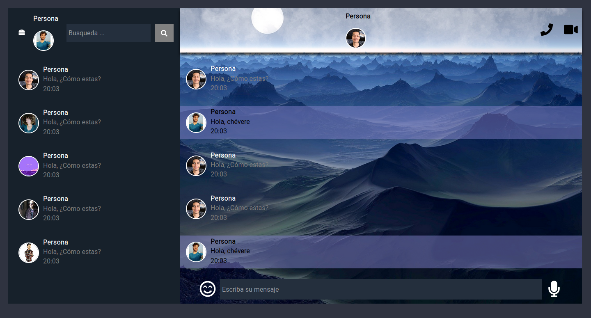
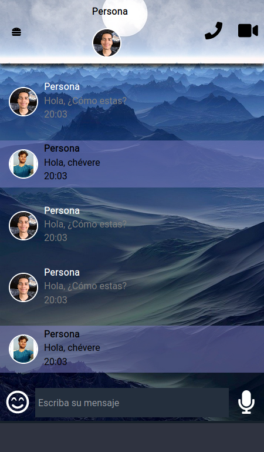

# wasagram!

La presente maqueta expone un frontend base referente a la estructuración de un chat, con css+js y normalize.
___

### Capturas de pantalla

>conversaciones + chat seleccionado

>vista movil del chat

>vista movil de las conversaciones
